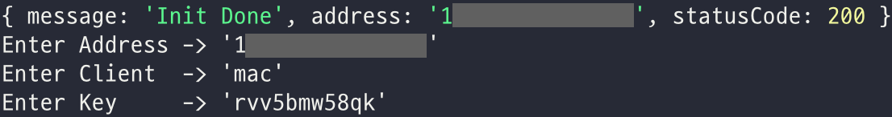
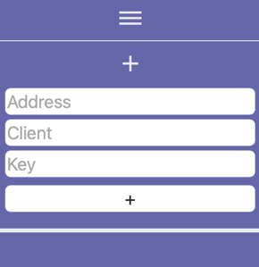

### Monitoring Resource Collector
[Web Server](https://github.com/kwondns/monitoring-nextjs)

#### 1. Docker 설치

#### 2. .env 파일 수정

`SERVER_HOST="http://address:port"`
`CLIENT_NAME="nickname"`

#### 3. start.sh을 실행시켜 사용

`chmod 755 start.sh`

`./start.sh`

#### 4. 정상 실행시 다음과 같은 안내가 출력

#### 5. 해당 값들을 웹에 접속하여 추가
